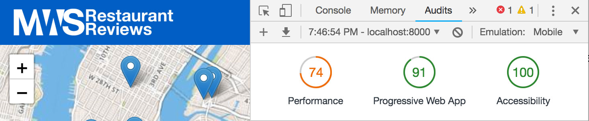

# Mobile Web Specialist Certification Course

#### Three Stage Course Material Project - Restaurant Reviews

# Table of contents
*  [Project Overview](#project-overview)
*  [Installation Instructions](#installation-instructions)
*  [Requirements](#requirements)
	*  [Application Data and Offline Use](#application-data-and-offline-use)
	*  [Responsive Design](#responsive-design)
	*  [Performance](#performance)

## Project Overview

For the **Restaurant Reviews** projects, you will incrementally convert a static webpage to a mobile-ready web application. 

In **Stage One**, you will take a static design that lacks accessibility and convert the design to be responsive on different sized displays and accessible for screen reader use. You will also add a service worker to begin the process of creating a seamless offline experience for your users.

In **Stage Two**, you will improve upon the project that you developed for **Stage One**. In this stage the project will connect to a Node server to retrieve restaurant data rather than a JSON file and the responses from the server will be stored in IndexedDB to allow for offline use. Finally, the project must exceed the specified lighthouse ratings.

In **Stage Three**, you will improve upon the project that you developed for **Stage Two**. In this stage, in addition to getting data from the server you will POST and PUT data to the server. Users should be able to mark a restaurant as a favorite and this toggle should be visible in the application. A form should be added to allow users to add their own reviews for a restaurant. Form submission works properly and adds a new review to the database. In addition to working online these two new features should also work offline, persist the data the IndexedDB, and then update the server when connectivity is re-established.

## Installation Instructions

1. Clone the development server provided by Udacity provided at [https://github.com/udacity/mws-restaurant-stage-3] and follow the instructions for installation and startup.

2. Clone this repository with `git clone https://github.com/farrellScript/mws-restaurant-project.git` and change directory into the folder.

3. In this folder, start up a simple HTTP server to serve up the site files on your local computer. Python has some simple tools to do this, and you don't even need to know Python. For most people, it's already installed on your computer.

In a terminal, check the version of Python you have: `python -V`. If you have Python 2.x, spin up the server with `python -m SimpleHTTPServer 8000` (or some other port, if port 8000 is already in use.) For Python 3.x, you can use `python3 -m http.server 8000`. If you don't have Python installed, navigate to Python's [website](https://www.python.org/) to download and install the software.

4. With your server running, visit the site: `http://localhost:8000`, and see the site with the updates for **Stage Three**.

## Technologies Used

* Service Worker: If the browser supporrts it, a service worker is registered and installed. This acts as a client-side proxy and allows the application to work offline, serving files from the Cache API if the network is unavailable.

* Cache API: Upon installation the service worker will precache the minimum amount of static assets needed for that application to work. As the user navigates through the application, when new assets are fetched they will also be added to the cache to be used if the network cannot be reached.

* IndexedDB: Fetch requests and responses to and from the remote server are stored inside of IndexedDB to be used if the network cannot be reached. If the user makes a `PUT` or `POST` request while offline the information is stored in IndexedDB then sent to the server when the connection has been re-established.

* Web Workers: Web workers are used in order to minimize the amount of javascript that is running on the main thread. This allows for computationally heavy logic to be run on a seperate background thread.

* Gulp: Gulp is used to transpile and optimize static assets for the development and production environment. Gulp will create WebP versions of all JPG's to be used by browsers that support it. For development purposes source maps are generated for SCSS and Javascript but those are intentionally left out of the production code to reduce file size.

* Webpack: The only npm package used in the production code is `IDB` which allows for interaction with IndexedDB using promises instead of the default syntax. Because the file is included using `import` Webpack is used to include the file in a way that browsers support. Webpack is not used on all Javascript files, just the web worker and service worker files because those are the only files that utilize `import`. 

## Requirements

### Functionality

* User Interface: A heart button has been added to allow users to favorite a restaurant and a form have been added allowing users to leave reviews to the restaurant detail template. Favoriting and/or leaving a comment will result in the data being persisted to IndexedDB and sent off to the server to be saved.

* Offline Use:
	* Upon installation the service worker will download all of the static files needed to run the application offline and store them using the Cache API: 
	

	* The fetch event listener listens for `GET` requests to `localhost:1337/`, which  retrieve restaurant and review information from the remote server. When a fetch request is made to this url the service worker will attempt to make a request to the server to get fresh data the put that data into IndexedDB for later user. If the user is offline, the service worker will check IndexedDB for a cached response and will return that if the page has been visited before.
	

	* If the user if offline when a restaurant is favorited or when a review is left, the service worker places the information into IndexedDB and when the user reconnects the serviceworker will check to see if what the browser has and what the server has matches. If the browser has newer information it will be synced to the server and IndexedDB will then be update. 

### Responsive Design and Accessibility

* Responsive Design: 
	* The application retains it's responsive design from the finished **Stage Two** and **Stage Two** projects. The initial provided code was not formated to work well on all device size. Using media queries and flexbox, I approached the project from a mobile first perspective to make sure that the homepage and detail pages worked on all size screens.
	* Responsive images are used across the site using a variety of techniques. Picture tags are used for all restaurant photos to provide WebM and JPG copies of each photo along with 1x and 2x options in the src-set. SVG's are used whenever possible to minimize file size and retain crispness at all sizes. The SVG icons used in this project were provided by https://visualpharm.com/ and are free with attibution for open source projects.
	
* Accessibility:
	* The application retains accessibility features from the **Stage One** and **Stage Two** projects. Images have alternate text, the application uses appropriate focus management for navigation, and semantic elements and ARIA attributes are used correctly. Roles are correctly defined for all elements of the review form.

	* Skip Link: A skip link is included at the top of the header and is offscreen until a user presses tab. When selected the user is brought down to the restaurant filters.

	* Focus: There is a notication toast that will appear at the bottom right hand side of the screen when a new service worker is available. When this happens, we record the element that had focus in case that's needed later and apply the focus to the text within the toast. Focus is temporarily trapped to prevent the user from tabbing outside of the toast unless the click one of the buttons or press escape.

	* ARIA: The maps on the homepage and detail page were given an ARIA role of application along with an ARIA label to describe what that section is. There is a service worker notication toast at the bottom of the page that has an attribute of aria-hidden to prevent it from being reached unless it becomes active.

### Performance

* Site Performance: The targets for this stage are a minimum of 90 for the Progressive Web App audit, 90 for the Performance Audit, and 90 for the Accessibility Audit. As seen below, each of these targets was exceeded for the homepage and the restaurant detail page:
	