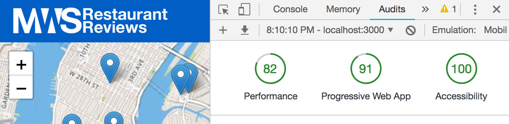

# Mobile Web Specialist Certification Course
---
#### _Three Stage Course Material Project - Restaurant Reviews_

## Project Overview: Stage 2

For the **Restaurant Reviews** projects, you will incrementally convert a static webpage to a mobile-ready web application. In **Stage Two**, you will improve upon the project that you developed for **Stage One**. In this stage the project will connect to a Node server to retrieve restaurant data rather than a JSON file and the responses from the server will be stored in IndexedDB to allow for offline use. Finally, the project must exceed the specified lighthouse ratings.

### Installation Instructions

1. Clone the development server provided by Udacity provided at [https://github.com/udacity/mws-restaurant-stage-2] and follow the instructions for installation and startup. 

2. Clone this repository with `git clone https://github.com/farrellScript/mws-restaurant-project.git` and change directory into the folder. 

3. In this folder, start up a simple HTTP server to serve up the site files on your local computer. Python has some simple tools to do this, and you don't even need to know Python. For most people, it's already installed on your computer. 

In a terminal, check the version of Python you have: `python -V`. If you have Python 2.x, spin up the server with `python -m SimpleHTTPServer 8000` (or some other port, if port 8000 is already in use.) For Python 3.x, you can use `python3 -m http.server 8000`. If you don't have Python installed, navigate to Python's [website](https://www.python.org/) to download and install the software.

4. With your server running, visit the site: `http://localhost:8000`, and see the site with the updates for **Stage Two**.

### Requirements

#### Application Data and Offline Use

* Application Data Source: In `dbhelper.js` the `DATABASE_URL` function has been updated to make requests to `http://localhost:1337/restaurants`.

* Offline Use: The fetch event listener in the service worker has been updated to listen for requests to `localhost:1337`. When a fetch request is made to this IndexedDB is checked to see if a previous response to this url has been cached. If it is, the cached version is returned. If it's not, the servers response it put into the cache then returned.

#### Responsive Design

* Responsive Design: The application retains it's responsive design from the finished Stage 1 project. The initially provided code was not formated to work well on all device size. Using media queries and flexbox, I approached the project from a mobile first perspective to make sure that the homepage and detail pages worked on all size screens. Responsive images are also used across the site along with the picture tag where it's useful and SVG icons where possible. The SVG icons used in this project were provided by [https://visualpharm.com/] and are free with attibution for open source projects.

* Accessibility: The application retains accessibility features from the Stage 1 project. When checked using the lighthouse accessibility audit this application receives a 100/100 rating.

#### Performance

* Site Performance: The targets for this stage are a minimum of 90 for the Progressive Web App audit, 70 for the Performance Audit, and 90 for the Accessibility Audit. As seen below, each of these targets was exceeded. 

